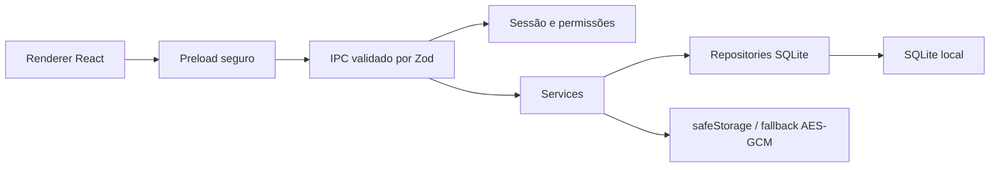
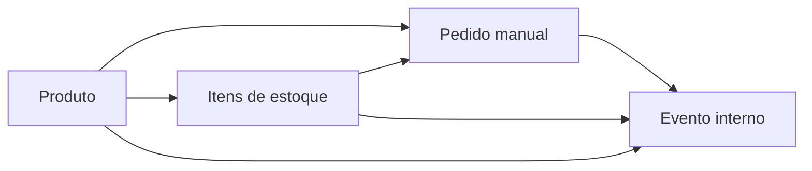
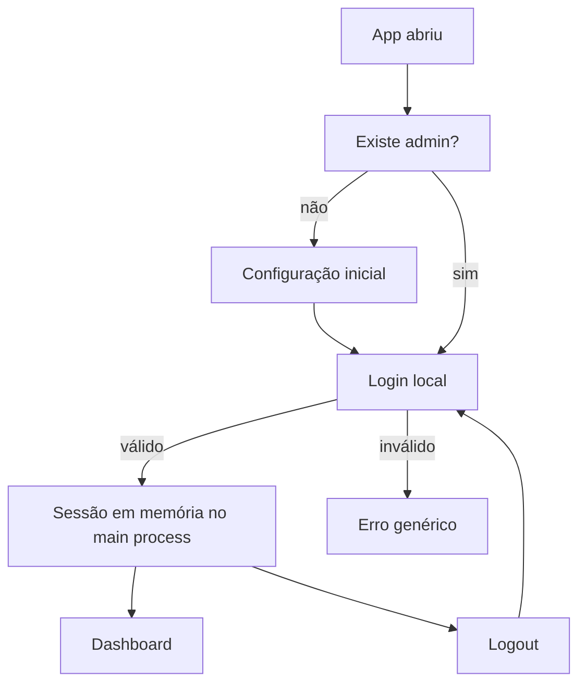
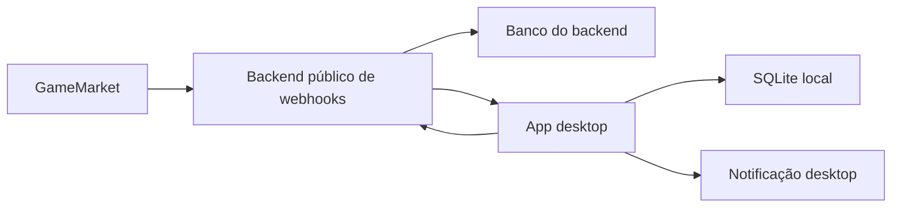

# Arquitetura

## Visão Atual

O HzdKyx GameMarket Manager é um app desktop local. O renderer React não acessa SQLite, filesystem ou criptografia diretamente. Essas responsabilidades ficam no processo principal do Electron e são expostas por canais IPC fechados.

## Fluxo Produto → Estoque → Pedido → Evento

Na Fase 3:

- Produto define catálogo, preço, custo, taxa, estoque operacional e status.
- Estoque registra itens concretos vinculados a produtos.
- Pedido manual guarda snapshots de produto, categoria/jogo, preço, custo, taxa, líquido, lucro e margem.
- Pedido pode vincular um item de estoque compatível com o produto.
- Mudanças de status de pedido geram eventos internos e atualizam o status do item de estoque quando aplicável.
- Eventos formam a timeline/auditoria local do pedido.

Essa separação mantém a operação manual e auditável sem inventar endpoints, eventos ou automações reais da GameMarket.

## SQLite e Migrations

O banco fica em `app.getPath("userData")/hzdk-gamemarket-manager.sqlite`.

As migrations runtime estão em `apps/desktop/src/main/database/migrations.ts`:

- `0000_initial_schema`: base da Fase 1.
- `0001_phase2_products_inventory`: amplia produtos e estoque, recria tabelas quando necessário para corrigir enums/check constraints e preservar dados existentes.
- `0002_phase3_orders_events`: recria pedidos e eventos com snapshots financeiros, vínculos com estoque/produto, timeline e índices de consulta.
- `0003_phase35_auth_users_audit`: adiciona `users`, colunas de auditoria por usuário e o evento `security.secret_revealed`.

A tabela `schema_migrations` registra o que já foi aplicado. O app executa migrations na inicialização do main process.

## Produtos

Campos persistidos:

- `internal_code`, `name`, `category`, `game`, `platform`
- `listing_url`
- `sale_price_cents`, `unit_cost_cents`, `fee_percent`
- `net_value_cents`, `estimated_profit_cents`, `margin_percent`
- `stock_current`, `stock_min`
- `status`, `delivery_type`, `supplier_id`, `notes`
- auditoria: `created_by_user_id`, `updated_by_user_id`

O cálculo financeiro é feito no service usando `packages/shared/src/financial.ts`, nunca duplicado na UI.

## Estoque

Campos persistidos:

- `inventory_code`
- `product_id`, `supplier_id`
- `purchase_cost_cents`
- `status`
- colunas criptografadas para login, senha, email, senha do email e notas de acesso
- `public_notes`
- datas de compra, venda e entrega
- `order_id` futuro
- auditoria: `created_by_user_id`, `updated_by_user_id`

Listagens e exportações retornam apenas metadados e flags sobre segredos. O segredo em texto aberto só retorna pelo IPC `inventory:revealSecret` após ação explícita do usuário na UI.

## Pedidos

Campos persistidos:

- `order_code`, `external_order_id`, `marketplace`
- `product_id`, `inventory_item_id`
- `buyer_name`, `buyer_contact`
- snapshots: `product_name_snapshot`, `category_snapshot`
- financeiros: `sale_price_cents`, `unit_cost_cents`, `fee_percent`, `net_value_cents`, `profit_cents`, `margin_percent`
- `status`, `action_required`, `marketplace_url`, `notes`
- datas de auditoria: `created_at`, `updated_at`, `confirmed_at`, `delivered_at`, `completed_at`, `cancelled_at`, `refunded_at`
- usuário: `created_by_user_id`, `updated_by_user_id`

O cálculo financeiro usa `calculateProductFinancials` de `packages/shared`. A UI pode sugerir valores vindos do produto, mas o cálculo final acontece no main process.

Regras de estoque vinculadas ao status do pedido:

- `payment_confirmed` e `awaiting_delivery`: reservam item `available`.
- `delivered`: marca item como `delivered`.
- `completed`: garante item `delivered` ou `sold`.
- `cancelled`: libera item `reserved` ainda não entregue.
- `refunded`: se não entregue, libera; se entregue/vendido, mantém como `refunded` para revisão.
- `mediation` e `problem`: não liberam automaticamente, apenas destacam ação manual.

## Eventos Internos

Eventos são auditoria local do app. Os tipos iniciais são controlados em `contracts.ts`:

- `order.created`
- `order.payment_confirmed`
- `order.awaiting_delivery`
- `order.delivered`
- `order.completed`
- `order.cancelled`
- `order.refunded`
- `order.mediation`
- `order.problem`
- `inventory.reserved`
- `inventory.released`
- `inventory.sold`
- `inventory.delivered`
- `inventory.problem`
- `product.low_stock`
- `product.out_of_stock`
- `security.secret_revealed`
- `system.notification_test`

`gamemarket_future` e `webhook_future` existem apenas como fontes reservadas para normalização futura. Eles não significam que já exista integração real.

Payload bruto é opcional, limitado e passa por mascaramento de chaves sensíveis como senha, token, secret, key e login.

Eventos também podem registrar `actor_user_id`. Para `security.secret_revealed`, o payload nunca contém o segredo revelado; contém apenas usuário, campo, item de estoque e data/hora.

## Autenticação Local

Fluxo:

A sessão local vive no main process e é perdida ao sair do app. Mesmo com UI protegida, os canais IPC também chamam `requireSession` ou `requirePermission`, então o renderer não consegue executar ações internas sem autenticação.

Tabela `users`:

- `id`
- `name`
- `username`
- `password_hash`
- `role`: `admin`, `operator`, `viewer`
- `status`: `active`, `disabled`
- `last_login_at`
- `failed_login_attempts`
- `locked_until`
- `must_change_password`
- `allow_reveal_secrets`
- `created_at`, `updated_at`

Senha:

- hash com `bcryptjs`;
- senha em texto puro nunca é persistida;
- hash nunca é enviado ao renderer;
- login inválido retorna “Usuário ou senha inválidos.”;
- após várias tentativas inválidas, o usuário fica bloqueado temporariamente.

## Permissões

Permissões calculadas por sessão:

- `canManageUsers`
- `canManageSettings`
- `canRevealSecrets`
- `canEditProducts`
- `canEditInventory`
- `canEditOrders`
- `canExportCsv`

Mapeamento:

- `admin`: todas as permissões.
- `operator`: edita produtos, estoque, pedidos e eventos; exporta CSV; revela segredos somente quando `allow_reveal_secrets = 1`.
- `viewer`: visualização de dashboard, produtos, pedidos e eventos; sem edição, exportação ou revelação de segredos.

O service de usuários impede desativar ou rebaixar o último admin ativo.

## Auditoria Local

Cada ação operacional importante cria um evento persistido no SQLite. A timeline do pedido consulta `events.order_id` em ordem cronológica. Essa estratégia permite:

- investigar mudança de status;
- ver quando estoque foi reservado, liberado, entregue ou marcado com problema;
- manter histórico local mesmo sem backend;
- preparar sincronização futura sem depender dela agora.

Não há deleção de segredos quando um pedido é entregue ou concluído. Segredos continuam protegidos no estoque e só aparecem mediante `inventory:revealSecret`.

## IPC

Canais da Fase 2:

Produtos:

- `products:list`
- `products:get`
- `products:create`
- `products:update`
- `products:delete`
- `products:exportCsv`

Estoque:

- `inventory:list`
- `inventory:get`
- `inventory:create`
- `inventory:update`
- `inventory:delete`
- `inventory:revealSecret`
- `inventory:exportCsv`

Canais adicionados na Fase 3:

Pedidos:

- `orders:list`
- `orders:get`
- `orders:create`
- `orders:update`
- `orders:delete`
- `orders:archive`
- `orders:changeStatus`
- `orders:linkInventoryItem`
- `orders:unlinkInventoryItem`
- `orders:exportCsv`

Eventos:

- `events:list`
- `events:get`
- `events:markRead`
- `events:markAllRead`
- `events:createManual`
- `events:exportCsv`

Dashboard:

- `dashboard:getSummary`

Configurações:

- `settings:getNotificationSettings`
- `settings:updateNotificationSettings`

Autenticação e usuários:

- `auth:getBootstrap`
- `auth:setupAdmin`
- `auth:login`
- `auth:logout`
- `auth:getSession`
- `auth:changeOwnPassword`
- `users:list`
- `users:create`
- `users:update`
- `users:resetPassword`

Todos os payloads são validados por schemas Zod em `apps/desktop/src/shared/contracts.ts` antes de tocar em repositories ou banco.

Os canais internos são protegidos por sessão. Ações de escrita e exportação exigem permissões específicas.

## Segurança

Responsabilidades:

- Renderer: coleta dados digitados e mostra segredos apenas após confirmação.
- Preload: expõe métodos tipados, sem canal IPC arbitrário.
- Main process: valida payloads, criptografa/descriptografa e persiste.
- Repositories: executam SQL parametrizado.
- Auth services: validam senha, mantêm sessão e calculam permissões.

Criptografia:

- Preferencial: `safeStorage` do Electron.
- Fallback: AES-256-GCM com chave aleatória local em `userData`.
- Tokens criptografados recebem prefixo de versão para permitir migrações futuras.
- Segredos antigos sem prefixo ainda tentam descriptografia via `safeStorage` para compatibilidade.

Limitações de segurança local:

- O app é desktop local; um usuário com acesso ao perfil do sistema operacional e privilégios sobre os arquivos locais pode tentar copiar o banco.
- `safeStorage` depende do cofre do sistema operacional.
- O fallback AES-GCM protege contra leitura casual, mas usa chave local em `userData`.
- A autenticação protege o uso normal do app e os canais IPC, não substitui criptografia de disco do Windows.

## Empacotamento Electron

O pacote desktop usa `electron-builder`.

Scripts:

- raiz: `npm run dist`
- workspace: `npm run dist --workspace @hzdk/gamemarket-desktop`

Configuração:

- `appId`: `br.com.hzdk.gamemarketmanager`
- `productName`: `HzdKyx GameMarket Manager`
- saída: `apps/desktop/release/`
- targets Windows: `nsis` e `portable`

O SQLite fica em `app.getPath("userData")`, portanto o caminho continua válido no app empacotado. As migrations rodam no main process durante a inicialização, tanto em desenvolvimento quanto no build.

## Arquitetura Final Proposta

Fases futuras adicionam backend público para webhooks e integração GameMarket real:

O app local não será endpoint direto de webhook. O backend público fará recepção, normalização e sincronização controlada.

## Estratégia Futura para Webhooks

Quando houver documentação oficial:

1. Receber webhooks em backend público.
2. Validar assinatura/autenticidade conforme especificação oficial.
3. Normalizar payload real para eventos internos já existentes ou novos tipos versionados.
4. Sincronizar com o desktop sem expor segredos locais.
5. Preservar o payload bruto somente quando necessário e sempre mascarado.

Nenhum endpoint da GameMarket foi inventado na Fase 3.

## Estratégia Futura para WhatsApp

WhatsApp deve entrar somente após:

- fluxo de pedidos e eventos local estar estável;
- política de envio/manual review estar definida;
- templates e consentimento do cliente estarem claros;
- backend externo existir para filas, retries e auditoria.

Na Fase 3, notificações são apenas desktop local/fallback visual.

## Riscos e Mitigações

- Documentação GameMarket inacessível: integração bloqueada até documentação oficial existir em `docs/gamemarket-api/`.
- Dados sensíveis: não logar, não exportar e não renderizar por padrão.
- SQLite nativo no Electron: manter acesso isolado no main process e usar `electron-rebuild` quando necessário.
- Evolução de schema: usar migrations incrementais registradas em `schema_migrations`.
- Automação futura de estoque: manter status e datas manuais agora para não assumir regras de negócio sem validação.
